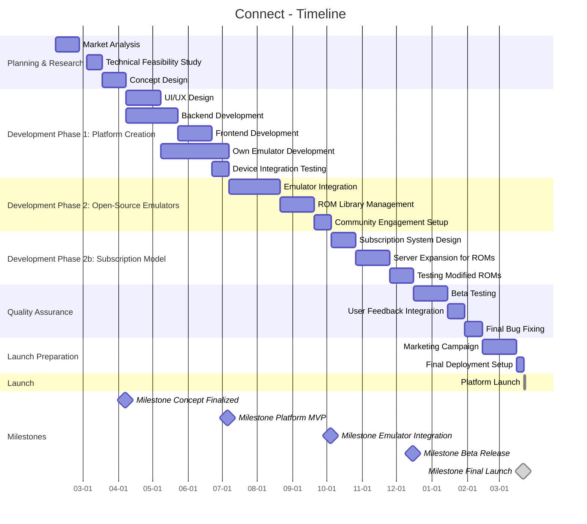
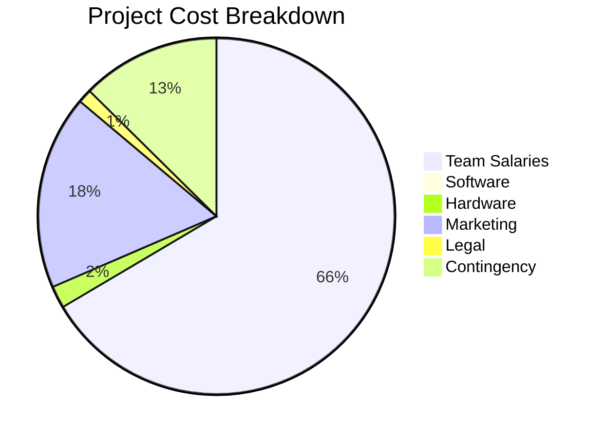
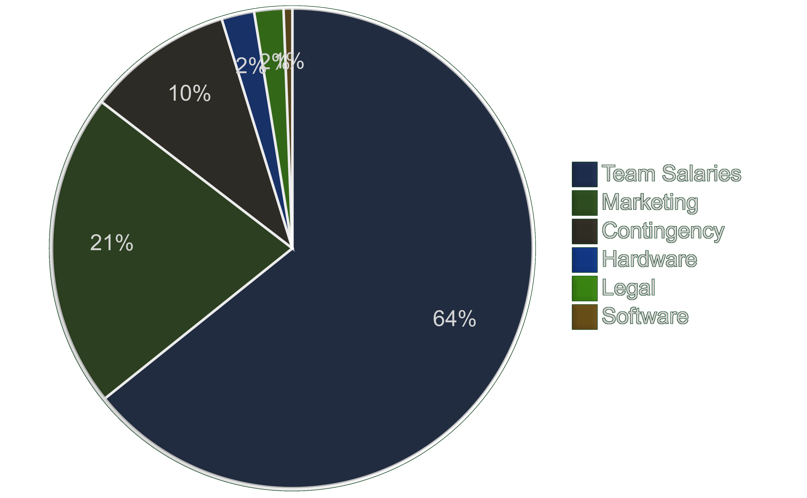

# 
 1. Initial Situation  

*Once upon a time, the board and card games found in every household brought together people of all ages – and in today's digitally connected world, gaming has become one of the most popular leisure activities.*

By merging these concepts, we can bring back the familial atmosphere of game nights into living rooms and beyond.
Despite the significant advancements in gaming technology, there remain challenges that hinder a seamless gaming experience. Particularly noticeable are the limitations due to dependence on specific hardware and the complexity of setting up multiple devices for group play.

### Security Risks:
  - Using cloud services for gaming can lead to privacy issues since sensitive data such as game saves or personal information might be stored in the cloud.

	- Security vulnerabilities in device communication could also lead to unauthorized access or data breaches.

### Complexity Issues:
  - Configuring multiplayer mode often requires complex setups, which can be a barrier for users less familiar with technology.

	- The need to synchronize various platforms and devices can negatively impact the gaming experience.

### Dependence on Third Parties:
  - Many games require special devices like consoles and controllers, which incurs additional costs and dependencies on manufacturers or cloud services.

	- This reduces the control users have over their gaming experience and raises the barrier to entry for new players.

Our [analysis of the current market]() shows that the avaliable offerings often do not meet these requirements.

---

## Inventing a Solution

To address the identified issues, we propose an innovative platform that leverages the power of open-source emulators combined with a versatile device connection system:

- ### Key Features:
  - **Popular family games**: Can be played out of the box.

  - #### Universal Device Integration:
    - **As Controllers**: Any smartphone or tablet can be transformed into a game controller through our intuitive software. Users can join a gaming session by scanning a QR code or using a short link, with the app automatically adapting the device's interface to act as a controller for the game.

    - **As Displays**: Similarly, any device with a browser can serve as a display. This includes smart TVs, laptops, tablets, and even smartphones, making it possible for players to share screens in real-time, whether they are in the same room or across the globe.

  - **Open-Source Emulators**: By integrating open-source emulators into our platform, we can support a wide array of classic and modern games without the need for proprietary hardware.

---

## Current Market Situation

- ### Cloud Gaming

	

      
 click for an overview 

	| **Aspect**                     | **Details**                                                                 |
	|--------------------------------|----------------------------------------------------------------------------|
	| **Market Size (2024)**         | Estimated at \$863.5 million ([FactMR](https://www.factmr.com))             |
	| **Projected Market Size (2032)**| Expected to reach \$143.4 billion by 2032, growing at a CAGR of 46.9% ([Scoop.market.us](https://scoop.market.us), [Market.us](https://market.us)) |
	| **Key Users**                  | Casual players, smartphone users, those without high-performance hardware ([Verified Market Research](https://www.verifiedmarketresearch.com)) |
	| **Leading Companies**           | Utomik BV, Nvidia Corporation, Google Stadia (Alphabet Inc), Ubitus Inc., Microsoft (Xbox Cloud Gaming) ([Roots Analysis](https://www.rootsanalysis.com), [SkyQuest Technology](https://www.skyquestt.com)) |
	| **Devices**                     | Smartphones, tablets, gaming consoles, PCs, smart TVs, head-mounted displays ([Statista Market Forecast](https://www.statista.com)) |
	| **Revenue Streams**             | Subscription models, partnerships with telecom operators, game publishers ([Verified Market Research](https://www.verifiedmarketresearch.com)) |
	| **Challenges**                  | Network latency, need for heavy infrastructure, not universally accessible internet speeds ([Expert Market Research](https://www.expertmarketresearch.com)) |
	| **Trends**                     | Increasing use of 5G, expansion into mobile gaming, integration with metaverse ([Scoop.market.us](https://scoop.market.us)) |

	

	- ### [Deeper research on Cloud Gaming](https://github.com/IxI-Enki/project-connect/blob/master/market-analysis.md)

- ### Traditional Consoles

	

    
 click for an overview 

	| **Aspect**                     | **Details**                                                                 |
	|--------------------------------|----------------------------------------------------------------------------|
	| **Market Size (2023)**         | Digital console gaming market sales at \$32.1 billion ([Newzoo's Global Games Market Report](https://newzoo.com)) |
	| **Projected Market Size (2032)**| Expected to grow from \\$11.3 billion in 2022 to \$44.1 billion by 2032, at a CAGR of 15% ([Statista](https://www.statista.com)) |
	| **Key Users**                  | Hardcore gamers, those preferring physical interaction with gaming ([Gaming Industry Insights](https://www.gamingindustryinsights.com)) |
	| **Leading Companies**           | Sony Interactive Entertainment (PlayStation), Microsoft (Xbox), Nintendo ([VentureBeat](https://venturebeat.com)) |
	| **Devices**                     | PlayStation, Xbox, Nintendo Switch ([IGN](https://www.ign.com))             |
	| **Revenue Streams**             | Game sales, console sales, subscription services, in-game purchases ([Gamasutra](https://www.gamasutra.com)) |
	| **Challenges**                  | High cost of entry, need for periodic hardware upgrades, physical space requirements ([Kotaku](https://kotaku.com)) |
	| **Trends**                     | Enhanced graphics capabilities, cross-platform play, subscription services expansion ([Polygon](https://www.polygon.com)) |

	

- ### PC Gaming

	

	  
 click for an overview 

	| **Aspect**                     | **Details**                                                                 |
	|--------------------------------|----------------------------------------------------------------------------|
	| **Market Size (2023)**         | Digital PC gaming market sales at \$45.8 billion ([Newzoo's Global Games Market Report](https://newzoo.com)) |
	| **Projected Market Size (2030)**| Predicted to reach around \$276.0 billion by 2033, with a CAGR of 11.2% from 2024 to 2033 ([Statista](https://www.statista.com)) |
	| **Key Users**                  | Enthusiasts, professional gamers, modders, those seeking customization ([PC Gamer](https://www.pcgamer.com)) |
	| **Leading Companies**           | Valve Corporation (Steam), Electronic Arts, Blizzard Entertainment ([Steam](https://store.steampowered.com), [GameSpot](https://www.gamespot.com)) |
	| **Devices**                     | Gaming PCs, laptops ([Tom's Hardware](https://www.tomshardware.com))       |
	| **Revenue Streams**             | Game sales, hardware sales, in-game purchases, subscription services ([Eurogamer](https://www.eurogamer.net)) |
	| **Challenges**                  | High setup cost, need for frequent hardware updates, piracy ([PCWorld](https://www.pcworld.com)) |
	| **Trends**                     | Increased focus on high-fidelity graphics, VR gaming, eSports, modding culture ([Wired](https://www.wired.com)) |

	

---

# 
 2. Concept 

> **Connect** is a platform that revolutionizes gaming by allowing any browser-capable device to be used as a display or controller.

## **Registration and Role Assignment:**
- **Display:** Each session can be shown on one or more displays.
- **Controller:** Smartphones or tablets can serve as game controllers.
- **Role Selection:** Users choose on the landing page whether their device will act as a display or controller.

## **Session Management:**
- **Session Creation:** A user creates a session and receives a QR code or link.
- **Session Joining:** Others scan the QR code or use the link to connect.
- **User-Friendliness:** Easy operation through QR codes and an intuitive, minimalist interface.
- **Flexibility:** Support for local, online, and mixed gaming modes.

## **Emulation:**
- **Own Emulator:** Start with our proprietary emulator for popular family games, beginning with card games like UNO, Schnapsen, then board games, all free and simple to use.
- **Expansion:** Gradually integrate open-source console emulators, one at a time, with community input on priority.

## **Technical Implementation:**
- **Web-App:** Blazor/AvaloniaUI for the frontend, ASP.NET for the backend, and a light/slim database/manager.
		<!-- React/Angular für Frontend, Node.js/Express.js oder Django für Backend, PostgreSQL/MongoDB für Datenbank. -->
- **Mobile-App:** Can be implemented with the same tech stack.
		<!-- React Native/Flutter für plattformübergreifende Entwicklung. -->

---

# 
 3. Objectives/Goals  

**Project Outline**

## Phase 1: Platform Creation

- **Onboarding and Connection:**
	- Develop a system for user onboarding and device/player connection.
		- **Simplicity & Accessibility**: The engine should be intuitive and easy to use for users of all ages.
		- **Platform Independence**: Games should run on any modern web browser without requiring installation or specialized hardware.

- **Own Emulator Introduction:**
	- Introduce an **own Emulator** for running popular family games, starting with card games like UNO and Schnapsen, followed by board games.
	- Emphasis on being uncomplicated and free.

- **Mobile Devices as Controllers/Game Pads:**
	- Smartphone and tablets can be registered as input devices since they are widely available and accessible to most users.

- **Flexible Display Options:**
	- Any internet-capable screen with a browser (e.g. SmartTVs, laptops, tablets, phones) can be used as a display for the game.

## Phase 2: Expansion to Open-Source Emulators

- **Integration of Open-Source Console Emulators:**
	- Gradually embed open-source emulators for various consoles, one at a time.
	- Establish a community-driven approach to decide the order of console inclusion.

- **ROM Library Management:**
	- Host-user provides a ROM - we check it against our library for authenticity.
	- If the ROM is an unaltered original, no upload of the entire rom is necessary, and we can instantly provide the game interface to both client and host users.
		> We won't store fully executable roms in our library, instead we provide the bulk of the rom-data from our servers and combine it with a fraction of the host-users rom.

### Phase 2b: Subscription for Advanced ROM Users

- **Subscription Model:**
	- Offer advanced users/creators the ability to upload "modified" ROMs to our servers.
	- These could be original games with altered gameplay mechanics ("hacked" titles) or entirely new, self-made games not previously available on our platform.
	- Requires additional server space for storage.

---

## Optimization for Multiplayer Scenarios

- **Couch Co-op**: Multiplayer, people in the same room play together.
- **Distant Multiplayer**: Players connect over the internet.
- **Multi-Screen**: Players can view different content on separate displays for innovative gameplay mechanics (e.g., active player, common area, opponent player).

## Technical Aspects and Expandability

- **Initial focus on Android + Chromium** for a quick development of a working prototype.
- **Possible future expansion to iOS + Safari** to reach a broader user-base.
- Use of modern web technologies to provide real-time interaction and synchronization.
- **Latency Minimization through Turn-Based Gameplay**: Since browser-based technologies inherently introduce some delays, the focus will be on turn-based games to ensure a fluid gaming experience.
---

# 
 4. General Conditions and Constraints 

## Technical Frameworks

- **Technology Stack**:
	- **Frontend**:
		Blazor/AvaloniaUI for the frontend
		<!-- HTML5, CSS and JavaScript includin g Libraries and Frameworks. -->

	- **Real-time communication**:
		WebSockets / WebRTC for synchronization between controllers and screens

	- **Backend**:
		ASP.NET for the backend
		<!-- Node.js with Express / WebSocket server for session and turn management. -->

	- **Storage**:
		Integration of SQL databases like ORACLEDB, MongoDB or Firebase.

	- **Compatibility**:
		Initial version Android & Chromium, later expansion to iOS.

## Gameplay Mechanics and Use Cases

- **Game Types**:
	Limited to turn-based or non-time-sensitive games because of the fact of latency issues, e.g. educational games, turn-based strategy a.s.o.

- **Connection Methods**:
	- Devices identify themselves via QR codes or short links for easy user-friendly registration in the game.
	- No app required - everything runs in te browser!

## Limitations and Challenges

- **Latency Issues**:
	Real-time games require fast reaction times.

- **Platform Differences**:
	iOS and Safari have different restrictions for WebSockets and WebRTC!

- **Privacy & Security**:
	- Minimization of personal data collection, the least possible data overhead.
	- Secure session management
	- No third-party cloud services needed unless necessary for data protection.

---

# 
 5. Opportunities and Risks  

## Risks

- **Technical Challenges:**
	- **Cross-Platform Compatibility:** Ensuring consistent performance across various browsers (e.g., Chrome, Firefox, Safari) and operating systems (Android, iOS) could be challenging.
	- **Scalability Issues:** As the user base grows, server load from hosting ROM libraries and managing modified ROM uploads could strain infrastructure.

- **Data Privacy and Security:**
	- **ROM Verification Risks:** The process of checking user-provided ROMs for authenticity could inadvertently expose the platform to malicious files or intellectual property disputes if not handled securely.
	- **User Data Exposure:** Storing user data (e.g., game progress, session information) could make the platform a target for cyberattacks.

- **Market Competition:**
	- **Established Emulator Platforms:** Competing with well-known emulator projects or platforms (e.g., RetroArch) that already have large communities and established ROM libraries could be difficult.

---

## Opportunities

- **Expandability:**
	- **AI-Driven Features:** Use AI to enhance gameplay, such as adaptive difficulty in games, or to assist in moderating and verifying user-uploaded ROMs for authenticity and safety.
	- **Educational Content:** Expand the platform to include educational games or simulations, leveraging the emulator framework to teach coding, history, or other subjects through interactive experiences.

- **Community Building:**
	- **User-Generated Content Ecosystem:** Encourage a thriving ecosystem where users can share, rate, and review modified ROMs, creating a vibrant, creative community around game development.

- **Monetization Potential:**
	- **Partnerships with Indie Developers:** Collaborate with indie game developers to feature their games on the platform, expanding the library and attracting new users.
	- **Sponsorships and Advertising:** Partner with brands for in-game sponsorships or non-intrusive ads, particularly during community events or tournaments.

- **Global Reach and Accessibility:**
	- **Localization:** Translate the platform and games into multiple languages to attract a global audience, especially in regions with high mobile device usage.
	- **Low-Bandwidth Optimization:** Further optimize the platform for users in areas with limited internet access, ensuring accessibility for a broader demographic.

- **Sustainability and Innovation:**
	- **Open-Source Collaboration:** Contribute to or collaborate with open-source emulator projects, enhancing credibility and potentially gaining support from the open-source community.
	---

# 
 6. Planning  

## Milestones

### **Concept Finalized**
  - **Date:** April 7, 2025
  - **Explanation:** This milestone marks the completion of the initial concept design phase. By this date, the core idea of the platform, including user interface design, game mechanics, and the overall vision, should be finalized, incorporating any feedback from potential users or stakeholders.

### **Platform MVP**
  - **Date:** July 6, 2025
  - **Explanation:** The Minimum Viable Product (MVP) of the platform is ready. This includes the basic functionality allowing users to connect devices, play games through the proprietary emulator, and manage sessions. It's a critical point to assess the platform's core functionalities before expanding further.

### **Emulator Integration**
  - **Date:** October 4, 2025
  - **Explanation:** This milestone indicates that the system for integrating open-source emulators and managing the ROM library is operational. Users can now upload, verify, and play games from various consoles, with a community-driven approach to prioritize which consoles to support.

### **Beta Release**
  - **Date:** December 15, 2025
  - **Explanation:** The beta version of the platform is released to a select group of users. This phase is crucial for gathering real-world user feedback, identifying bugs, and understanding user acceptance and needs. Adjustments based on this feedback will be integrated into the final product.

### **Final Launch**
  - **Date:** March 22, 2026
  - **Explanation:** This milestone signifies the completion of all preparatory work for the official launch. It includes final checks like server load tests, ensuring all systems are go, and marketing efforts are in place. The day before the actual launch is dedicated to ensuring everything is set for a successful rollout.

---

## Current Team

  |   *colaborators*  |   *profile*                            |
  |:-----------------:|:--------------------------------------:|
  |  Imre Obermüller  |   [git](https://github.com/Imre7777)   |
  |  Jan Ritt         |   [git](https://github.com/IxI-Enki)   |

---

## Budget

    
 click for a comprehensive cost estimation 

### Development Costs
- **Team Salaries:**
	- **Full-Time Developers:**
		- 2-3 Developers at €80.000 - €150.000/year each = **€160.000 - €450,000/year**.
	- **Part-Time/Contractors:**
		- UI/UX, Art, etc. at €50/hour for 10 hours/week, 4 specialists = **€104.000/year**.

- **Software Tools and Licenses:**
	- Game Development (e.g., Unity/UE): €0 - €1500/year.
	- Web Tools, Hosting, Domain: €1000 - €5000/year.
	- **Total Software Costs:** **€1000 - €6500/year**.

- **Hardware:**
	- **Development Servers:** €5000 - €10.000.
	- **Testing Devices:** €3000 - €10.000.
	- **Total Hardware Costs:** **€8000 - €20.000**.

- **Marketing and Promotion:**
	- **Initial Launch:**
		- Social Media, Influencers, Ads = **€10.000 - €20.000**.
	- **Ongoing Marketing:**
		- Monthly Costs = **€5000 - €15.000/month**.
		- Annual Ongoing = **€60.000 - €180.000/year**.
	- **Total Marketing:** **€70.000 - €200.000/year**.

- **Legal and Compliance:**
	- Legal Advice for Copyright, ROMs = **€5000 - €20.000**.

- **Contingency Fund:**
	- 10% - 15% of budget = **€50.000 - €75.000**.

- **Total Estimated Budget for First Year:**
  - **Low Estimate:** €400.000
  - **High Estimate:** €750.000 (Including higher salaries, robust marketing).

- #### Mean Costs Breakdown

<!---

-->

 

> **Note:** These figures are speculative and should be adjusted based on actual team composition, legal requirements, and marketing strategy effectiveness, launch and advertising of the platform.
