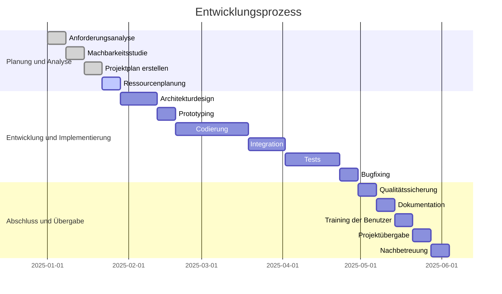
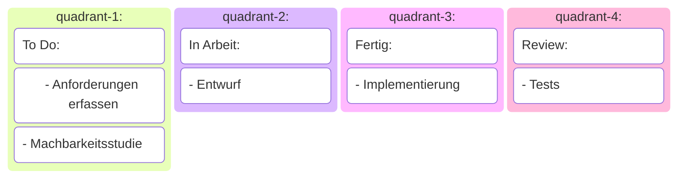
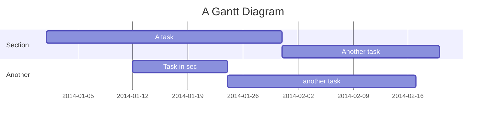
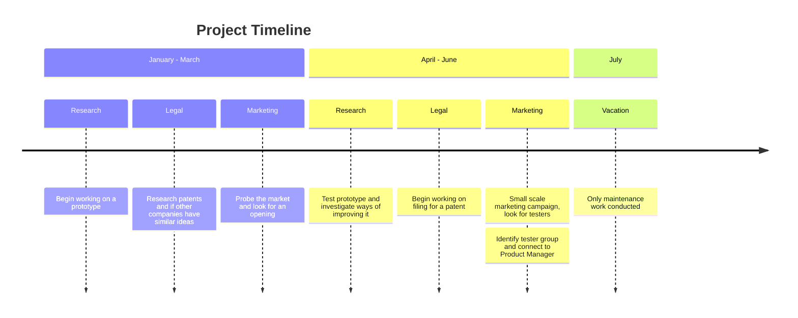
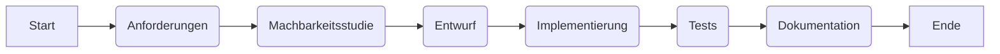
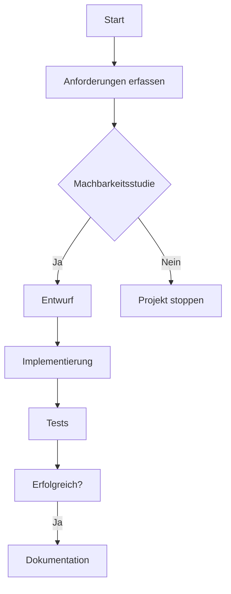

```mermaid
gantt
	title Entwicklungsprozess
	dateFormat  YYYY-MM-DD
	axisFormat  %Y-%m-%d

	section Planung und Analyse
	Anforderungsanalyse     :done, a1, 2025-01-01, 1w
	Machbarkeitsstudie      :done, a2, after a1, 1w
	Projektplan erstellen   :done, a3, after a2, 1w
	Ressourcenplanung       :active, a4, after a3, 1w

	section Entwicklung und Implementierung
	Architekturdesign       :a5, after a4, 2w
	Prototyping             :a6, after a5, 1w
	Codierung               :a7, after a6, 4w
	Integration             :a8, after a7, 2w
	Tests                   :a9, after a8, 3w
	Bugfixing               :a10, after a9, 1w

	section Abschluss und Übergabe
	Qualitätssicherung      :a11, after a10, 1w
	Dokumentation           :a12, after a11, 1w
	Training der Benutzer   :a13, after a12, 1w
	Projektübergabe         :a14, after a13, 1w
	Nachbetreuung           :a15, after a14, 1w
```

---

```mermaid
kanban
	quadrant-1:
		To Do:
			- Anforderungen erfassen
			- Machbarkeitsstudie
	quadrant-2:
		In Arbeit:
			- Entwurf
	quadrant-3:
		Fertig:
			- Implementierung
	quadrant-4:
		Review:
			- Tests
```

---

```mermaid
gantt
	title A Gantt Diagram
	dateFormat  YYYY-MM-DD
	section Section
	A task           :a1, 2014-01-01, 30d
	Another task     :after a1  , 20d
	section Another
	Task in sec      :2014-01-12  , 12d
	another task      : 24d
```

---

```mermaid
timeline
	title Project Timeline
	section January - March
		Research : Begin working on a prototype
		Legal : Research patents and if other companies have similar ideas
		Marketing : Probe the market and look for an opening
	section April - June
		Research : Test prototype and investigate ways of improving it
		Legal : Begin working on filing for a patent
		Marketing : Small scale marketing campaign, look for testers : Identify tester group and connect to Product Manager
	section July
		Vacation : Only maintenance work conducted
```

---

```mermaid
graph LR
	A[Start] --> B(Anforderungen)
	B --> C(Machbarkeitsstudie)
	C --> D(Entwurf)
	D --> E(Implementierung)
	E --> F(Tests)
	F --> G(Dokumentation)
	G --> H[Ende]
```

---

```mermaid
flowchart TD
	A[Start] --> B[Anforderungen erfassen]
	B --> C{Machbarkeitsstudie}
	C -->|Ja| D[Entwurf]
	C -->|Nein| E[Projekt stoppen]
	D --> F[Implementierung]
	F --> G[Tests]
	G --> H[Erfolgreich?]
	H -->|Ja| I[Dokumentation]
```