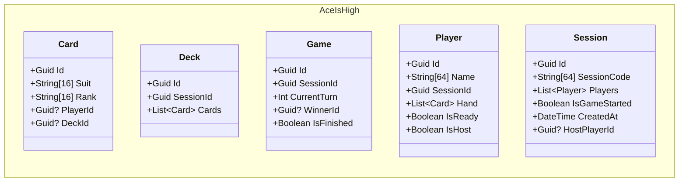

---
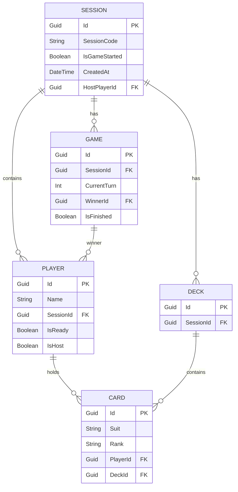
---
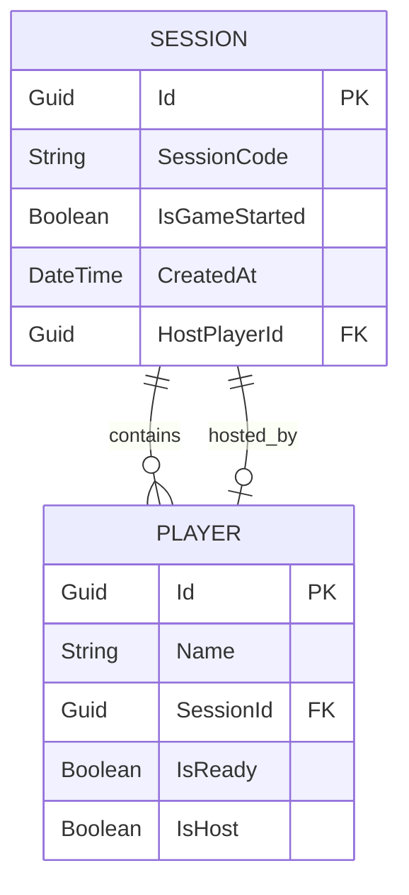
---
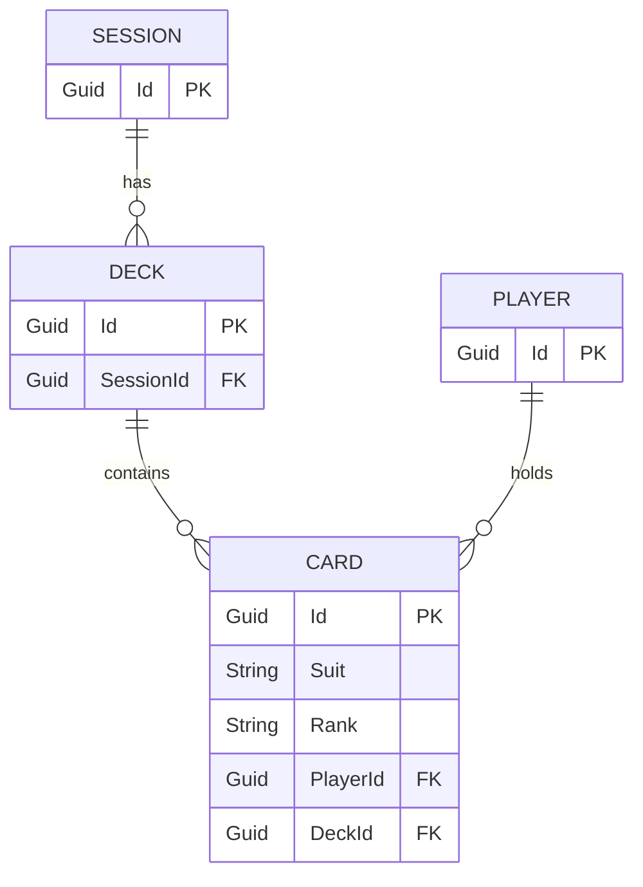
---
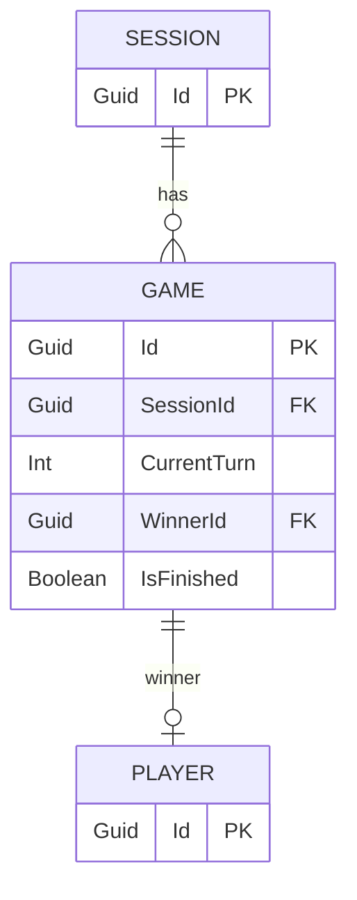

---
# 
 Ace is High - Sequenzdiagramme 

---

## 1. Starten einer Session
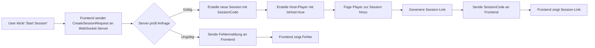
---
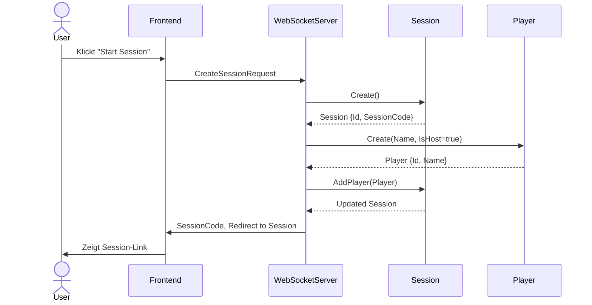
---

## 2. Beitreten einer Session
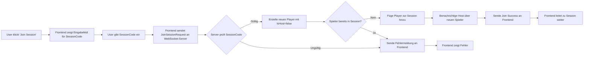
---
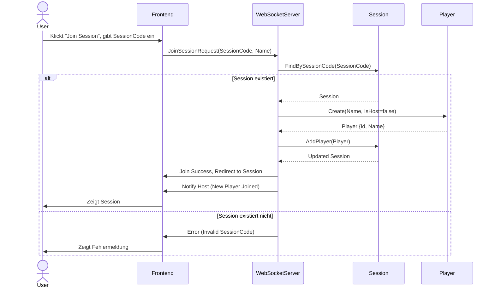
---

## 3. Spielstart
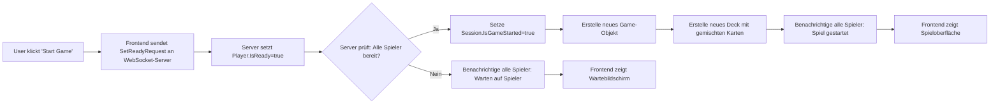
---
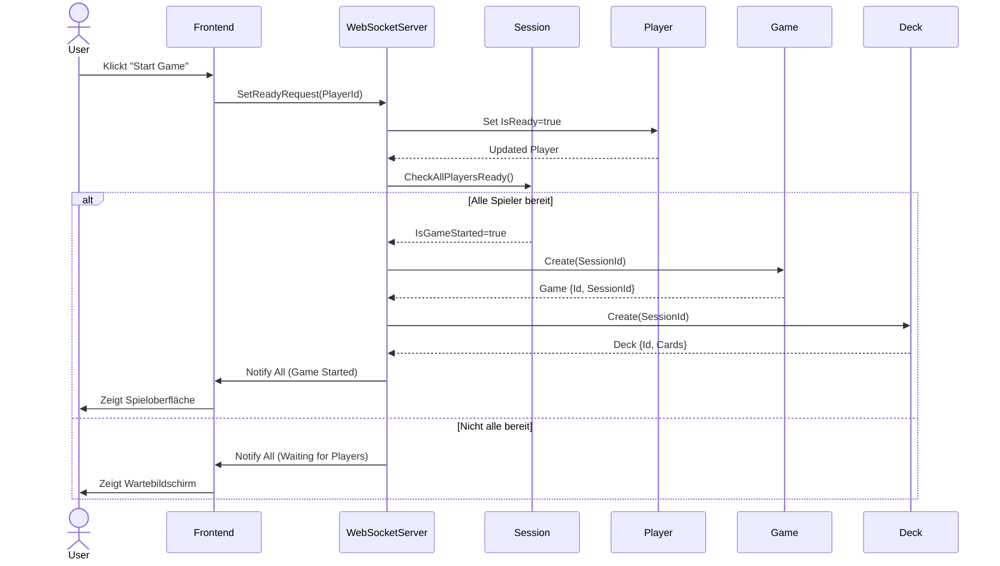
---

## 4. Kartenziehen und Rundenablauf
```mermaid
graph LR
    A[Spiel gestartet] --> B{Für jeden Spieler}
    B --> C[Deck: Ziehe Karte]
    C --> D[Player: Füge Karte zu Hand hinzu]
    D --> E[Benachrichtige Spieler: Neue Karte]
    E --> F{Nächster Spieler?}
    F -->|Ja| C
    F -->|Nein| G[Starte Rundenablauf]
    G --> H{Für jede Runde}
    H --> I[Game: Bestimme aktuellen Spieler]
    I --> J[Benachrichtige Spieler: Dein Zug]
    J --> K[Spieler wählt Karte]
    K --> L[Frontend sendet PlayCard an Server]
    L --> M[Player: Entferne Karte aus Hand]
    M --> N[Game: Speichere gespielte Karte]
    N --> O[Game: Nächster Zug]
    O --> P[Benachrichtige alle: Karte gespielt]
    P --> Q{Nächste Runde?}
    Q -->|Ja| H
    Q -->|Nein| R[Gehe zu Gewinnerermittlung]
```
---
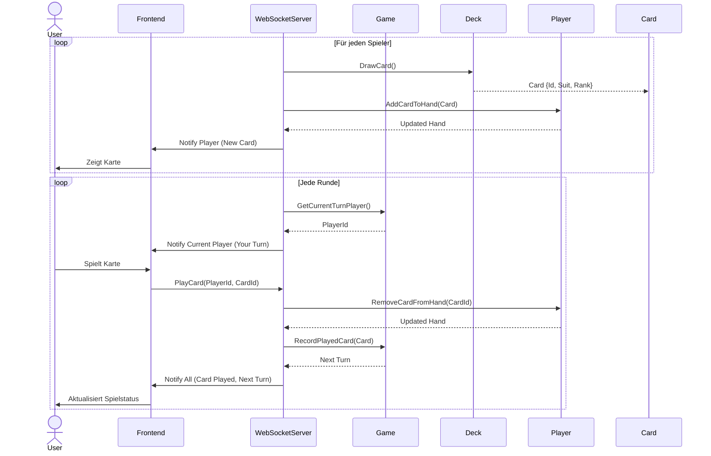
---

## 5. Gewinnerermittlung
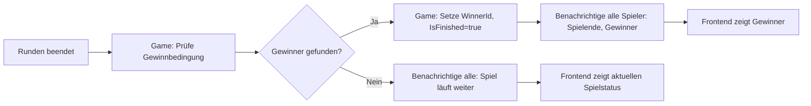
---
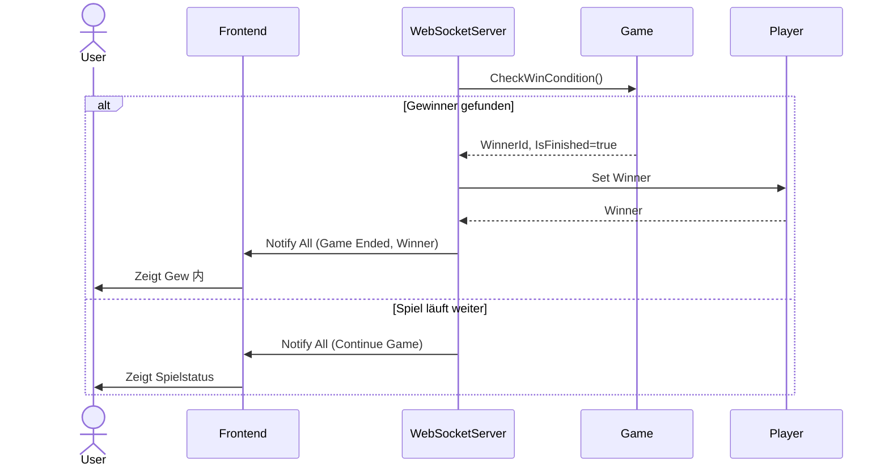
---