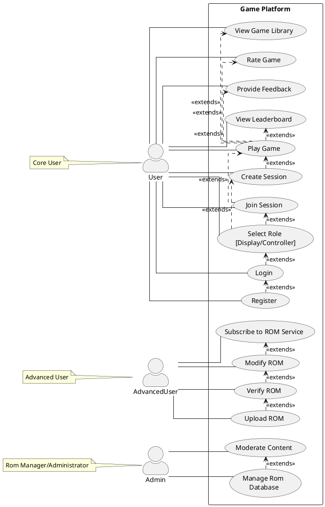

```plantuml
@startuml

skinparam actorStyle awesome
left to right direction

actor User as user
actor AdvancedUser as advancedUser
actor Admin as Admin

rectangle "Game Platform" {
  usecase (Register) as (UC1)
  usecase (Login) as (UC2)
  usecase (Select Role \n[Display/Controller]) as (UC3)
  usecase (Create Session) as (UC4)
  usecase (Join Session) as (UC5)
  usecase (Play Game) as (UC6)
  usecase (View Game Library) as (UC7)
  usecase (Rate Game) as (UC8)
  usecase (Provide Feedback) as (UC9)
  usecase (Upload ROM) as (UC10)
  usecase (Verify ROM) as (UC11)
  usecase (Modify ROM) as (UC12)
  usecase (Subscribe to ROM Service) as (UC13)
  usecase (Manage Rom \nDatabase) as (UC14)
  usecase (Moderate Content) as (UC15)
  usecase (View Leaderboard) as (UC16)
}

user -- (UC1)
user -- (UC2)
user -- (UC3)
user -- (UC4)
user -- (UC5)
user -- (UC6)
user -- (UC7)
user -- (UC8)
user -- (UC9)
user -- (UC16)

advancedUser -- (UC10)
advancedUser -- (UC11)
advancedUser -- (UC12)
advancedUser -- (UC13)

Admin -- (UC14)
Admin -- (UC15)

UC1 .> UC2 : <<extends>>
UC2 .> UC3 : <<extends>>
UC3 .> UC4 : <<extends>>
UC3 .> UC5 : <<extends>>
UC4 .> UC6 : <<extends>>
UC5 .> UC6 : <<extends>>
UC6 .> UC7 : <<extends>>
UC6 .> UC8 : <<extends>>
UC6 .> UC9 : <<extends>>
UC10 .> UC11 : <<extends>>
UC11 .> UC12 : <<extends>>
UC12 .> UC13 : <<extends>>
UC14 .> UC15 : <<extends>>
UC6 .> UC16 : <<extends>>

' Layout improvements
skinparam linetype ortho
skinparam ranksep 80
skinparam nodesep 25
skinparam layout smetana

'

note left of user
  Core User
end note

note left of advancedUser
  Advanced User
end note

note left of Admin
  Rom Manager/Administrator
end note

@enduml
```