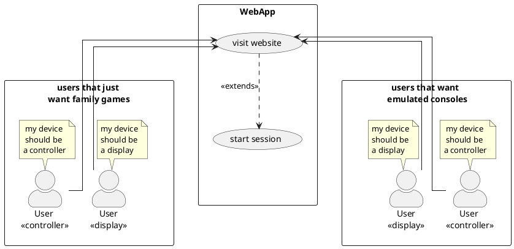

```plantuml
@startuml

' skinparam rankdir "LR"
skinparam linetype ortho
skinparam actorStyle awesome
skinparam ranksep 19
' # Increase vertical space between ranks
skinparam nodesep 35
' # Increase horizontal space between nodes

rectangle "users that just \nwant family games" as 0 {

	actor "    User\n<<display>>" as uD
	note top of uD
	my device
	should be
	a display
	end note
' -left[hidden]-
' -right[hidden]-
' -up[hidden]-
' -down[hidden]-

	actor "      User\n<<controller>>" as uC
	note top of uC
	 my device
	 should be
	a controller
	end note
uD -left[hidden]- uC
'uC -right[hidden]- uD
' uC -down[hidden]- uD
' uC -[hidden]- uD

}
' 0 -right[hidden]- 1
' 0 -left[hidden]- 1
' 0 -down[hidden]- 1
' 0 -[hidden]- 1

rectangle "users that want \n emulated consoles" as 1 {

	actor "    User\n<<display>>" as uDC
	note top of uDC
	my device
	should be
	a display
	end note
' 1 -right[hidden]- uDC
' 1 -left[hidden]- uDC
' 1 -down[hidden]- uDC
' 1 -[hidden]- uDC


	actor "      User\n<<controller>>" as uCC
	note top of uCC
	 my device
	 should be
	a controller
	end note
' uCC -right[hidden]- uDC
uCC -left[hidden]- uDC
' uCC -down[hidden]- uDC
' uCC -[hidden]- uDC

}
' 1 -right[hidden]- 0
' 1 -left[hidden]- 0
'uDC -left[hidden]- uD
' 1 -down[hidden]- 0
' 1 -up[hidden]- 0
' uCC ~~ uC
' uDC ~~ uD


rectangle "WebApp" as WA {

  usecase (visit website) as vw
  usecase (start session) as ss
}
WA -right[hidden]- 1
WA -left[hidden]- 0

0 -up[hidden]- WA
0 -right[hidden]- WA
1 -up[hidden]- WA
1 -left[hidden]- WA

0 -down[hidden]- WA
1 -down[hidden]- WA
0 -down[hidden]- WA
1 -down[hidden]- WA

vw -left[hidden]- 1
vw -down[hidden]- 1

WA -left[hidden]- 1
WA -right[hidden]- 0
WA -up[hidden]- 1
WA -up[hidden]- 0


uC --> vw
uD --> vw
uCC --> vw
uDC --> vw

vw -.-> ss : <<extends>>
ss -down[hidden]- WA
ss -down[hidden]- WA
ss -down[hidden]- WA


@enduml


```

<!--
' -left[hidden]-
' -right[hidden]-
' -up[hidden]-
' -down[hidden]-
-->
