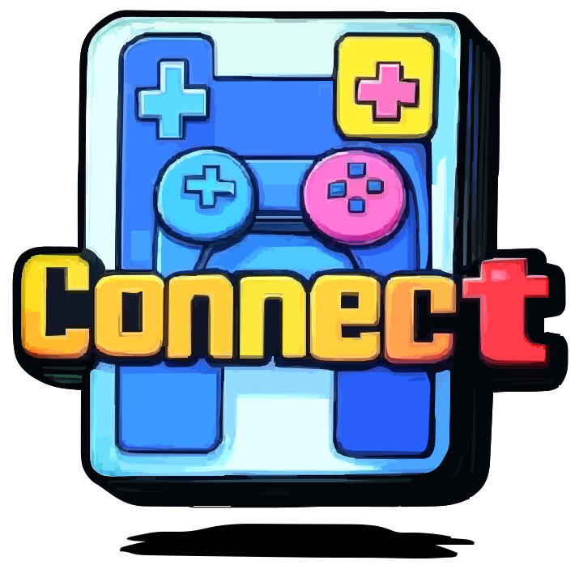

<!-- Syp Project --->

  

# 
 [Full Proposal](proposal.md)

  |    *Team-Member*    |   *git-profiles*                       |
  |:-------------------:|:--------------------------------------:|
  |   Imre Obermüller   |   [git](https://github.com/Imre7777)   |
  |   Jan Ritt          |   [git](https://github.com/IxI-Enki)   |

  ---

## 
 Table of Contents 

## 1. [*Initial Situation*](https://github.com/IxI-Enki/project-connect/blob/proposal-final/proposal.md#-1-initial-situation--)
  - ### 1.1 [Problem](https://github.com/IxI-Enki/project-connect/blob/proposal-final/proposal.md#security-risks)
  - ### 1.2 [Inventing a Solution](https://github.com/IxI-Enki/project-connect/blob/proposal-final/proposal.md#inventing-a-solution)
  - ### 1.3 [Current Market Situation](https://github.com/IxI-Enki/project-connect/blob/proposal-final/proposal.md#current-market-situation)

## 2. [*Concept*](https://github.com/IxI-Enki/project-connect/blob/proposal-final/proposal.md#-2-concept-)
  - ### 2.1 [Registration and Role Assignment](https://github.com/IxI-Enki/project-connect/blob/proposal-final/proposal.md#registration-and-role-assignment)
  - ### 2.2 [Session Management](https://github.com/IxI-Enki/project-connect/blob/proposal-final/proposal.md#registration-and-role-assignment)
  - ### 2.3 [Emulation](https://github.com/IxI-Enki/project-connect/blob/proposal-final/proposal.md#emulation)
  - ### 2.4 [Technical Implementation](https://github.com/IxI-Enki/project-connect/blob/proposal-final/proposal.md#emulation)

## 3. [*Objectives/Goals*](https://github.com/IxI-Enki/project-connect/blob/proposal-final/proposal.md#-3-objectivesgoals--)
  - ### 3.1 [Phase 1) Platform Creation](https://github.com/IxI-Enki/project-connect/blob/proposal-final/proposal.md#phase-1-platform-creation)
  - ### 3.2 [Phase 2) Expansion to Open-Source Emulators](https://github.com/IxI-Enki/project-connect/blob/proposal-final/proposal.md#phase-1-platform-creation)
    - ### [Phase 2b) Subscription for Advanced ROM Users](https://github.com/IxI-Enki/project-connect/blob/proposal-final/proposal.md#phase-2b-subscription-for-advanced-rom-users)
  - ### 3.3 [Optimization for Multiplayer Scenarios](https://github.com/IxI-Enki/project-connect/blob/proposal-final/proposal.md#optimization-for-multiplayer-scenarios)
  - ### 3.4 [Technical Aspects and Expandability](https://github.com/IxI-Enki/project-connect/blob/proposal-final/proposal.md#optimization-for-multiplayer-scenarios)

## 4. [*General Conditions and Constraints*](https://github.com/IxI-Enki/project-connect/blob/proposal-final/proposal.md#-4-general-conditions-and-constraints-)
  - ### 4.1 [Technical Frameworks](https://github.com/IxI-Enki/project-connect/blob/proposal-final/proposal.md#-4-general-conditions-and-constraints-)
  - ### 4.2 [Gameplay Mechanics and Use Cases](https://github.com/IxI-Enki/project-connect/blob/proposal-final/proposal.md#-4-general-conditions-and-constraints-)
  - ### 4.3 [Limitations and Challenges](https://github.com/IxI-Enki/project-connect/blob/proposal-final/proposal.md#-4-general-conditions-and-constraints-)

## 5. [*Opportunities and Risks*](https://github.com/IxI-Enki/project-connect/blob/proposal-final/proposal.md#-4-general-conditions-and-constraints-)
  - ### 5.1 [Risks](https://github.com/IxI-Enki/project-connect/blob/proposal-final/proposal.md#risks)
  - ### 5.2 [Opportunities](https://github.com/IxI-Enki/project-connect/blob/proposal-final/proposal.md#opportunities)

## 6. [*Planning*](https://github.com/IxI-Enki/project-connect/blob/proposal-final/proposal.md#-6-planning--)
  - ### 6.1 [Milestones](https://github.com/IxI-Enki/project-connect/blob/proposal-final/proposal.md#-6-planning--)
    - #### Ⅰ ) [Concept Finalized](https://github.com/IxI-Enki/project-connect/blob/proposal-final/proposal.md#concept-finalized)
    - #### Ⅱ ) [Minimum Viable Product (MVP)](https://github.com/IxI-Enki/project-connect/blob/proposal-final/proposal.md#minimum-viable-product-mvp)
    - #### Ⅲ ) [Emulator Integration](https://github.com/IxI-Enki/project-connect/blob/proposal-final/proposal.md#minimum-viable-product-mvp)
    - #### Ⅳ ) [Beta Release](https://github.com/IxI-Enki/project-connect/blob/proposal-final/proposal.md#beta-release)
    - #### Ⅴ ) [Final Launch](https://github.com/IxI-Enki/project-connect/blob/proposal-final/proposal.md#beta-release)
  - ### 6.2 [Current Team](https://github.com/IxI-Enki/project-connect/blob/proposal-final/proposal.md#current-team)
  - ### 6.3 [Budget](https://github.com/IxI-Enki/project-connect/blob/proposal-final/proposal.md#current-team)
    - #### [Development Costs Estimation](https://github.com/IxI-Enki/project-connect/blob/proposal-final/proposal.md#estimate-on-cost-distribution)

---
