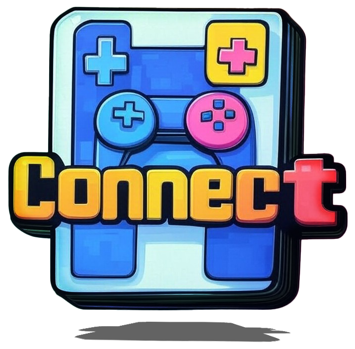

<!-- Syp Project --->

  

1. Initial Situation
   1. Problem
   2. Solution & Challenges
2. Concept
   1. Registration and Role Assignment
   2. Session Management
   3. Technical Implementation
3. Objectives/Goals
4. General Conditions and Constraints
   1. Technical Frameworks
   2. Gameplay Mechanics and Use Cases
   3. Limitations and Challenges
5. Opportunities and Risks
   1. Risks
      1. Comprehensive Market Analysis
   2. Opportunities
   3. Summary
6. Planning
   1. Timeline
   2. Resources

> ### [Full Proposal](project-proposal.md)

  |   *colaborators*   |   *profile*   |
  |:------:|:------:|
  |   Imre Obermüller   |   [git](https://github.com/Imre7777)   |
  |   Jan Ritt          |   [git](https://github.com/IxI-Enki)   |

